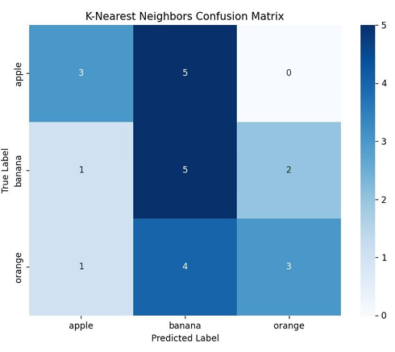
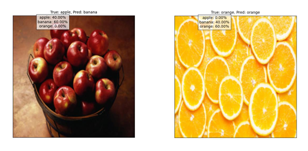

# Fruit Image Classifier

## 📌 Overview

**Fruit Image Classifier** is a machine learning project focused on classifying fruit images  
(apples, bananas, and oranges) using two supervised learning algorithms: **Naive Bayes** and **k-Nearest Neighbors (k-NN)**.  
The goal is to compare their performance in terms of accuracy, precision, recall, and F1-score.  

## 🚀 Features

- Preprocessed dataset of fruit images (resized, scaled, and flattened for compatibility with ML algorithms)  
- Implemented and trained **Naive Bayes** and **k-NN** classifiers  
- Evaluated models using metrics: accuracy, precision, recall, F1-score, and confusion matrix  
- Comparative analysis between Naive Bayes and k-NN performance  

## 🛠️ Technologies Used

- **Language**: Python  
- **Libraries**: NumPy, scikit-learn, Matplotlib, PIL  
- **Dataset**: [Fruit Dataset (Kaggle)](https://www.kaggle.com/datasets/shreyapmaher/fruits-dataset-images)  

## 📊 Results

- **Naive Bayes Accuracy**: ~58%  
- **k-Nearest Neighbors Accuracy**: ~46% (depending on the value of K, best result ~62.5% with K=3)  

Observations:  
- Naive Bayes is simple, fast, and stable but limited by its independence assumption.  
- k-NN offers flexibility with distance metrics and K tuning, but can be computationally expensive for larger datasets.  

## 📸 Screenshots

### Confusion Matrix Example

### Prediction Examples

